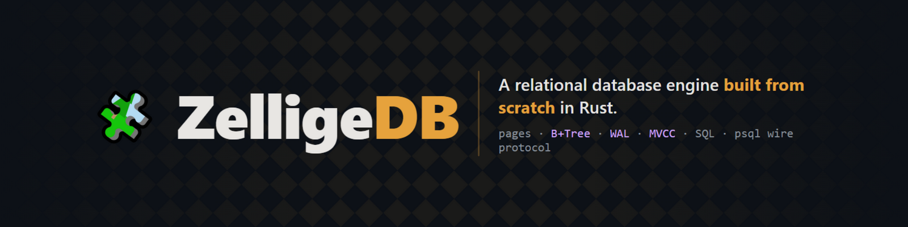

<div align="center">



[](https://github.com/hajar-benhadj/zellige-db/actions/workflows/ci.yml)
[](https://github.com/hajar-benhadj/zellige-db/actions/workflows/deploy-pages.yml)
[](https://github.com/hajar-benhadj/zellige-db/releases)
[](https://github.com/hajar-benhadj/zellige-db/actions)
[](LICENSE)
[](https://github.com/hajar-benhadj/zellige-db/blob/main/crates/zdb-core/src/lib.rs)

[**▶ Try it in your browser**](https://hajar-benhadj.github.io/zellige-db/) · [Release v0.1.0](https://github.com/hajar-benhadj/zellige-db/releases) · [Build log](docs/blog/01-hello-zelligedb.md) · [ADRs](docs/adr/)

*No database libraries. No parser libraries. No `unsafe`. 65 tests, 3 operating systems, one engine — from pages on disk to a wire protocol real `psql` clients speak.*

</div>

---

## 🧩 Why "Zellige"?

**Zellige** (زليج) is the Moroccan craft of hand-cutting terracotta tiles and
assembling them — piece by piece, for over a thousand years — into the
geometric mosaics that cover mosques, fountains, and palaces. No glue holding
a picture together: every tile must sit *exactly* right, or the whole pattern
tells on it.

That is precisely how this engine is built, and why it carries the name:

| zellige craft | ZelligeDB engineering |
|---|---|
| every tile is cut by hand | every 4 KiB page is laid out byte by byte — no storage library does it for you |
| a cracked tile is spotted at once and replaced | every page carries a CRC32 checksum; corruption is caught at read time, never silently propagated |
| the pattern only holds if each tile sits exactly right | the B+Tree, WAL, and MVCC layers all carry structural integrity checkers |
| the mosaic is assembled piece by piece, over months | the engine grew phase by phase — pager → tree → journal → SQL — each landing with tests and a written decision record |

And like zellige, the result is not a wall decoration: it is meant to be
walked on, used, and admired up close.

## Why this exists

Plenty of tutorials build a toy key-value store and stop. ZelligeDB builds
the parts that make a database **trustworthy**, and proves them:

| | |
|---|---|
| 🔁 **Crash-proof by design** | Every mutation is journaled before it touches the data file. The crash suite tears the journal at 200 adversarial offsets and simulates `kill -9` — committed data survives *every* crash point, uncommitted data never leaks. |
| 🧪 **Correctness as a feature** | ~40,000 randomized B+Tree operations verified against `BTreeMap`; **600 randomized SQL queries run against SQLite and must match exactly**; a full structural integrity checker per layer. |
| ⚡ **Measured, not promised** | Index scans **132× faster** than full scans. Batched transactions **7.8× faster** than auto-commit. Every number reproducible via `cargo bench`. |
| 🗣️ **Speaks Postgres** | A stock `psql` connects to it — real wire protocol v3, real SQLSTATE error codes, psql-style command tags. |
| 🌐 **Runs in a browser tab** | The same engine compiles to WebAssembly over an in-memory backend. The playground executes SQL client-side. |
| 🚫 **`deny(unsafe_code)`** | The entire engine — page I/O, B+Tree, WAL, recovery — compiles with zero `unsafe`. |

## See it working

**Stock `psql`, zero adaptation:**

```text
$ psql -h 127.0.0.1 -p 5432
zellige=> CREATE TABLE users (id INTEGER, name TEXT, city TEXT);
CREATE TABLE
zellige=> INSERT INTO users VALUES (1,'hajar','casablanca'), (2,'amine','rabat');
INSERT 0 2
zellige=> SELECT * FROM users WHERE id = 2;
 id | name  | city
----+-------+-------
  2 | amine | rabat
(1 row)
```

**The built-in REPL:**

```text
$ zdb
zellige=> CREATE TABLE t (id INTEGER, score INTEGER);
zellige=> INSERT INTO t VALUES (1, 90), (2, 75), (3, 88);
INSERT 0 3
zellige=> SELECT * FROM t WHERE score > 80 ORDER BY score DESC;
┌────┬───────┐
│ id │ score │
├────┼───────┤
│ 1  │ 90    │
│ 3  │ 88    │
└────┴───────┘
(2 rows)
```

## Quick start

```bash
git clone https://github.com/hajar-benhadj/zellige-db
cd zellige-db

cargo build --release
cargo run -p zdb-server            # SQL REPL (creates zellige.zdb)
cargo run -p zdb-server -- serve   # wire server → connect with: psql -h 127.0.0.1

cargo test                         # 65 tests across 15 suites
cargo bench                        # the numbers above, on your machine
```

SQL surface at v0.1: `CREATE/DROP TABLE`, `CREATE/DROP INDEX`, `INSERT`,
`SELECT` (WHERE · multi-column ORDER BY · LIMIT · COUNT(*)), `UPDATE`,
`DELETE`, `BEGIN/COMMIT/ROLLBACK`, `SHOW TABLES`, expressions with `LIKE`
and `IS NULL`.

## Numbers

Reproduce everything with `cargo bench` — full tables and methodology in
[docs/benchmarks.md](docs/benchmarks.md).

| benchmark | result |
|---|---|
| point query via index vs full scan (10k rows) | **132× faster** |
| inserts batched in one txn vs per-statement auto-commit | **7.8× faster** |
| page cache (ADR-0008) | **−25–35%** on read-heavy paths |

Honest footnote: `UPDATE`/`DELETE` filters still full-scan in v0.1 (the
index planner covers `SELECT`), and updates append row versions with no GC
yet. Roadmap items, not accidents.

## How it fits together

```
┌──────────────────────────────────────────────────┐
│  zdb-server   REPL · TCP server · pg wire proto  │
├──────────────────────────────────────────────────┤
│  zdb-sql      lexer → parser → planner →         │
│               Volcano executor · MVCC sessions   │
├──────────────────────────────────────────────────┤
│  zdb-core     WAL · B+Tree · page cache · Pager  │
├──────────────────────────────────────────────────┤
│  PageFile     OS file (fsync)  |  memory (wasm)  │
└──────────────────────────────────────────────────┘
```

| crate | role |
|---|---|
| [`zdb-core`](crates/zdb-core) | pages, B+Tree, write-ahead log, transactions, recovery |
| [`zdb-sql`](crates/zdb-sql) | hand-written SQL front-end: lexer → parser → planner → executor |
| [`zdb-server`](crates/zdb-server) | REPL, TCP listener, Postgres wire protocol |
| [`zdb-wasm`](crates/zdb-wasm) | wasm-bindgen bindings for the browser playground |

## Correctness, in practice

The claims above are backed by infrastructure, not vibes:

- **Randomized crash tests** — `mem::forget` as `kill -9`, 200-point
  journal tearing, torn data-file repair, rollback isolation
  ([tests](crates/zdb-core/tests/wal_crash.rs))
- **Property tests** — deterministic 5-line LCG (reproducible seeds), vs
  `BTreeMap` as the reference model, integrity walk every 500 ops
  ([tests](crates/zdb-core/tests/btree_property.rs))
- **Differential tests** — identical random workloads against SQLite,
  rows must match exactly, order included
  ([tests](crates/zdb-sql/tests/sql_differential.rs), Linux CI)
- **CI on Linux/Windows/macOS** — rustfmt, clippy `-D warnings`, full suite

One war story, because it sells the method: adding the page cache
introduced a stale-read bug — recovery's raw writes bypassed the cache, so
a *repaired* meta page read back *stale* and recovery failed on healthy
data. The crash suite caught it on its **first run** after the change.
Two-line fix; the test that caught it stays forever.

## Roadmap

| phase | milestone | status |
|-------|-----------|--------|
| 0–1 | workspace, CI, pager, CRC32 | ✅ |
| 2 | B+Tree + property tests | ✅ |
| 3 | WAL + crash recovery + crash harness | ✅ |
| 4 | SQL front-end + differential testing vs SQLite | ✅ |
| 5 | secondary indexes + MVCC | ✅ |
| 6 | Postgres wire protocol | ✅ |
| 7 | benchmarks + page cache | ✅ |
| 8 | WASM playground on GitHub Pages | ✅ |
| 9 | v0.1.0 release + build log | ✅ |

**Next (v0.2):** extended query mode (GUI clients) · UPDATE/DELETE through
the index planner · row-version GC · OPFS persistence for the playground ·
group commit · JOIN & GROUP BY.

## Documentation

- 📝 [Build log — *I built a database engine from scratch*](docs/blog/01-hello-zelligedb.md)
- 📐 [Architecture overview](docs/ARCHITECTURE.md)
- 📊 [Benchmarks](docs/benchmarks.md)
- 📜 [Architecture Decision Records](docs/adr/)

<details>
<summary><b>All 9 ADRs</b> — every design decision, with its alternatives</summary>

| ADR | decision |
|-----|----------|
| [0001](docs/adr/0001-adopt-rust.md) | Rust as the implementation language |
| [0002](docs/adr/0002-page-size-and-format.md) | 4 KiB pages, header layout, CRC32 integrity model |
| [0003](docs/adr/0003-btree-design.md) | B+Tree node layout and rebalancing policy |
| [0004](docs/adr/0004-wal-and-recovery.md) | Full-page redo WAL and the recovery algorithm |
| [0005](docs/adr/0005-sql-frontend-and-differential-testing.md) | Hand-written SQL front-end + the SQLite referee |
| [0006](docs/adr/0006-mvcc-sessions-and-indexes.md) | MVCC, sessions, and the single-writer rule |
| [0007](docs/adr/0007-postgres-wire-protocol.md) | Postgres wire protocol (simple query mode) |
| [0008](docs/adr/0008-page-cache-and-bench-harness.md) | Page cache and a dependency-free bench harness |
| [0009](docs/adr/0009-pagefile-and-wasm.md) | PageFile abstraction and the in-memory database |

</details>

<details>
<summary><b>ملاحظات التعلم</b> — per-phase learning notes (بالدارجة)</summary>

Every phase of the build is documented in Moroccan Darija, pairing each new
concept with the exact code that exercised it:

[phase 0](docs/learning-notes/phase-0.md) ·
[1](docs/learning-notes/phase-1.md) ·
[2](docs/learning-notes/phase-2.md) ·
[3](docs/learning-notes/phase-3.md) ·
[4](docs/learning-notes/phase-4.md) ·
[5](docs/learning-notes/phase-5.md) ·
[6](docs/learning-notes/phase-6.md) ·
[7](docs/learning-notes/phase-7.md) ·
[8](docs/learning-notes/phase-8.md) ·
[9](docs/learning-notes/phase-9.md)

</details>

## Contributing

Issues and pull requests are welcome. House rules: conventional commits,
`cargo fmt` + `cargo clippy -D warnings` green, tests for every behavior
change, and an ADR whenever a *why* changes.

## Acknowledgments

Huge debts to: **SQLite** (the differential referee and the gold standard
for embedded engineering), *Database Internals* by Alex Petrov, CMU
15-445, and the papers behind Raft, MVCC, and LSM storage that made this a
journey through the literature rather than guesswork.

And to the maalems — the master artisans of Fez and Marrakech — whose
mosaics inspired the name and, honestly, the engineering discipline too.

## License

[MIT](LICENSE) © Hajar Benhadj
